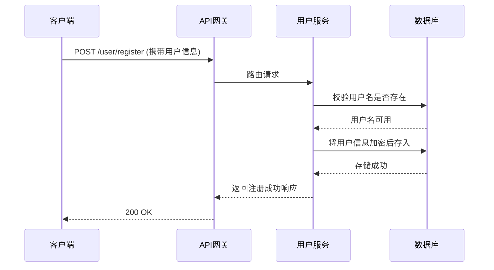
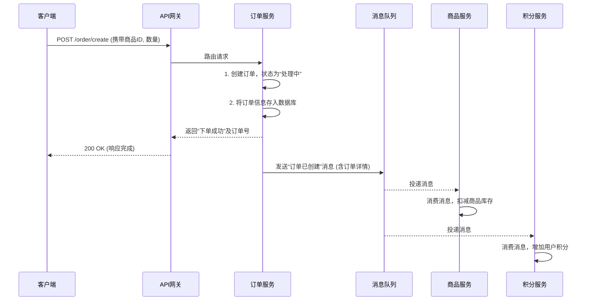

# 电商微服务项目深度解析

本文档旨在深度剖析该电商项目的架构设计思路与代码实现细节，帮助开发者“真正吸收”项目，而不仅仅是读懂。文档分为宏观与微观两个层面，分别阐述系统的业务逻辑链路与代码的语法结构链路。

---

## 一、 宏观架构与业务逻辑链路 (Implementation Idea Logic Chain)

这一部分聚焦于 **“为什么这么设计”**，阐述系统整体的架构选型、各服务间的协作模式以及核心业务流程。

### 1.1 核心设计思想：分而治之 (Divide and Conquer)

项目采用**微服务架构**，其根本动机是将一个庞大、复杂的电商系统，按照业务领域（Business Domain）垂直切分为一组小而美的、独立的服务。

- **痛点解决**：规避了单体应用（Monolith）技术栈单一、代码臃肿、开发部署效率低下、系统可用性差等问题。
- **设计目标**：实现**高内聚、低耦合**。每个服务只关心自己的业务，可以独立开发、测试、部署和扩展，互不影响。

### 1.2 架构组件与协作模式

系统由以下几个核心部分组成，它们像一个协同工作的团队：

| 组件 | 扮演角色 | 直观类比 | 技术实现 |
| :--- | :--- | :--- | :--- |
| **API 网关 (`gatewayservice`)** | **系统总入口/前台** | 公司前台，负责接待、安检、路由 | Spring Cloud Gateway |
| **服务注册与发现中心** | **服务通讯录** | 实时更新的公司通讯录 | Nacos Discovery |
| **业务微服务** | **各职能部门** | 用户部、商品部、订单部... | Spring Boot Applications |
| **消息队列 (`RocketMQ`)** | **内部异步邮局** | 内部高效的信件/任务派发系统 | RocketMQ |
| **容器化平台 (`Docker`)** | **标准化办公室** | 提供标准化的集装箱式工位 | Docker, Docker Compose |

### 1.3 核心业务逻辑链路

#### 链路一：用户注册/登录 (同步调用)

这是最基础的同步交互链路，强调请求-响应的即时性。



- **逻辑核心**：`客户端 -> 网关 -> 用户服务 -> 数据库`。这是一个简单、直接的调用链，所有步骤必须同步完成，才能给用户最终反馈。

#### 链路二：创建订单 (同步 + 异步混合)

这是项目最核心、最能体现架构优势的链路，它通过**同步操作保证核心功能可用，异步操作实现服务解耦和性能提升**。

**直观类比**：去一家高级餐厅点餐。
1.  **同步部分**：你告诉服务员（`客户端` -> `订单服务`）你要点什么菜。服务员在点餐系统里为你创建了订单，并立刻给你一个订单号，告诉你“下单成功，请稍候”。这个过程非常快。
2.  **异步部分**：服务员（`订单服务`）不会站在原地等你所有的菜都做好。他会将做菜的指令（`消息`）通过内部系统（`消息队列`）发送给后厨的各个档口（`商品服务`扣库存，`积分服务`加积分）。



- **逻辑核心**：
    1.  **主干流程（同步）**：`订单服务` 只负责创建订单核心数据，并立即响应用户，保证了下单接口的高可用和低延迟。
    2.  **分支流程（异步）**：库存和积分作为下游流程，通过 `消息队列` 解耦。即使 `积分服务` 暂时不可用，也不影响用户下单，保证了系统的**鲁棒性**。这实现了分布式事务中的**最终一致性**模型。

---

## 二、 微观实现与代码分层逻辑 (Syntax Structure Logic Chain)

这一部分聚焦于 **“代码是如何组织的”**，深入单个微服务内部，阐述其遵循的经典分层架构和代码执行流程。

### 2.1 技术栈与核心依赖

- **核心框架**: Spring Boot 2.x, Spring Cloud Alibaba
- **数据持久化**: Spring Data JPA / MyBatis
- **构建工具**: Maven
- **消息通信**: `rocketmq-spring-boot-starter`

### 2.2 经典三层架构 (Layered Architecture)

每个业务微服务（如 `userservice`, `productservice`）内部都遵循着清晰的**三层架构**，确保职责分离。

```
+---------------------------------------------------+
|               Controller Layer (控制层)             |
|  (处理HTTP请求, 参数校验, 调用Service层, 返回响应)    |
|  @RestController, @RequestMapping, @GetMapping    |
+---------------------------------------------------+
                        |
                        v
+---------------------------------------------------+
|                 Service Layer (业务层)              |
|  (核心业务逻辑, 事务管理, 组合调用Repository)       |
|  @Service, @Transactional                         |
+---------------------------------------------------+
                        |
                        v
+---------------------------------------------------+
|               Repository/DAO Layer (数据访问层)     |
|  (与数据库交互, 提供CRUD操作)                       |
|  @Repository, JpaRepository, @Mapper              |
+---------------------------------------------------+
                        |
                        v
+---------------------------------------------------+
|               Entity / DTO (模型层)                 |
|  (数据库实体对象, 数据传输对象)                     |
+---------------------------------------------------+
```

### 2.3 代码执行链路：以“查询商品详情”为例

我们来追踪一个 `GET /product/{id}` 请求在 `productservice` 内部的完整生命周期。

1.  **进入 `Controller` 层**
    - 客户端请求 `http://<gateway-ip>/product/1`。
    - 网关将请求路由到 `productservice` 的 `ProductController`。
    - `ProductController` 中匹配路径的方法被触发。

    ```java
    // ProductController.java
    @RestController
    @RequestMapping("/product")
    public class ProductController {

        @Autowired
        private ProductService productService;

        @GetMapping("/{id}")
        public ProductDTO getProductById(@PathVariable Long id) {
            // 1. 接收到路径参数 id
            // 2. 调用 Service 层处理业务
            return productService.findById(id);
        }
    }
    ```

2.  **进入 `Service` 层**
    - `Controller` 调用 `ProductService` 的 `findById` 方法。
    - `Service` 层负责具体的业务逻辑（此处逻辑简单，直接调用 `Repository`）。

    ```java
    // ProductService.java
    @Service
    public class ProductServiceImpl implements ProductService {

        @Autowired
        private ProductRepository productRepository;

        @Override
        public ProductDTO findById(Long id) {
            // 3. 调用 Repository 层从数据库查询
            Product product = productRepository.findById(id)
                .orElseThrow(() -> new RuntimeException("Product not found"));
            
            // 4. 将 Entity 转换为 DTO (避免暴露数据库结构)
            ProductDTO dto = new ProductDTO();
            BeanUtils.copyProperties(product, dto);
            return dto;
        }
    }
    ```

3.  **进入 `Repository` 层**
    - `Service` 层调用 `ProductRepository`（一个继承自 `JpaRepository` 的接口）。
    - Spring Data JPA 自动根据方法名生成 SQL 查询语句，并与数据库交互。

    ```java
    // ProductRepository.java
    @Repository
    public interface ProductRepository extends JpaRepository<Product, Long> {
        // Spring Data JPA 会自动实现 findById(Long id) 方法
    }
    ```

4.  **数据模型 (`Entity` 和 `DTO`)**
    - `Repository` 从数据库获取数据，并将其封装成 `Product` 实体对象。
    - `Service` 层将 `Product` (Entity) 转换为 `ProductDTO` (Data Transfer Object)，只暴露给前端需要的数据。

    ```java
    // Product.java (Entity)
    @Entity
    public class Product {
        @Id
        private Long id;
        private String name;
        private Double price;
        private Integer stock; // 包含库存等敏感或内部信息
    }

    // ProductDTO.java (DTO)
    public class ProductDTO {
        private Long id;
        private String name;
        private Double price; // 只暴露给客户端的字段
    }
    ```

5.  **返回响应**
    - `Service` 层将 `ProductDTO` 返回给 `Controller`。
    - `Controller` 将 `ProductDTO` 对象序列化为 JSON 格式，作为 HTTP 响应体返回给客户端。

通过这个流程，一个请求被清晰、有序地在不同层之间处理，每一层都只做自己的事，完美体现了**单一职责原则**。
